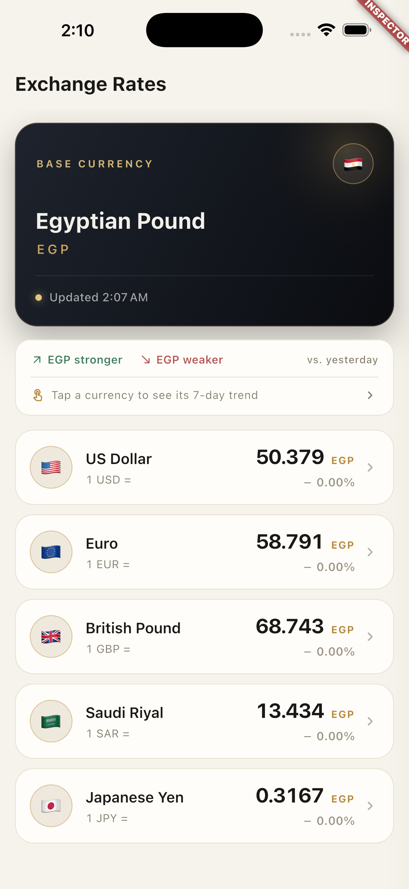
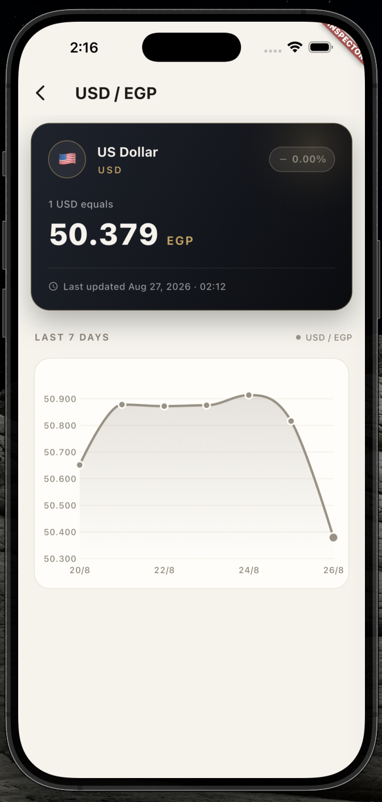

# Currency Tracker

A Flutter app that shows live EGP exchange rates and a 7-day history per
currency, with offline support. Built for the Axis assessment.

<p align="center">
  
  &nbsp;&nbsp;
  
</p>

## Features

- **Latest rates** — current EGP value of each supported currency, with the
  day-over-day change (up / down / flat).
- **Currency detail** — a 7-day line chart of the selected currency's rate.
- **Offline-first** — the last successful load is cached; when the device is
  offline the app serves that cache and shows an offline banner.
- **Typed error handling** — every failure (no internet, timeout, bad response)
  becomes a clear, user-facing message.

## Getting started

```bash
flutter pub get
flutter run
```

Runs on Android, iOS, web, and desktop. No API key or config needed — the rate
data comes from the public [currency-api](https://github.com/fawazahmed0/exchange-api).

## Running tests

```bash
flutter test
```

## Architecture

Clean Architecture with three layers, one feature (`rates`):

```
presentation  →  Bloc + widgets (UI state only)
domain        →  entities, repository interfaces, use cases (pure Dart)
data          →  API + cache, models, repository implementation
```

Key decisions:

- **State management** — `flutter_bloc`. One bloc per screen
  (`RatesListBloc`, `RateDetailBloc`).
- **Networking** — `dio`, hidden behind an `ApiClient` abstraction so no
  Dio type leaks above the network layer. Errors are mapped once:
  `DioException → AppException → Failure`.
- **Error handling** — repositories return `Either<Failure, T>` (`dartz`); the
  UI never sees exceptions.
- **Offline cache** — `hive_ce` stores the last snapshot. A dedicated
  `CachedRatesModel` is persisted (codes + numbers only) rather than the raw API
  response or the domain entity.
- **Connectivity** — `internet_connection_checker_plus`, which verifies real
  reachability rather than just the interface state.
- **DI** — `get_it`, wired in `core/di/injector.dart`.

## Project structure

```
lib/
├── core/            # network, error handling, DI, theme, shared utils
└── features/rates/
    ├── data/        # data sources, models, repository impl
    ├── domain/      # entities, repository interfaces, use cases
    └── presentation/# blocs, pages, widgets
```

## Git hooks

A pre-commit hook runs `dart format` and `flutter analyze` before each commit.
Git doesn't track `.git/hooks/`, so install it once after cloning:

```bash
cp tool/hooks/pre-commit .git/hooks/ && chmod +x .git/hooks/pre-commit
```

Skip it for a single commit with `git commit --no-verify`.
